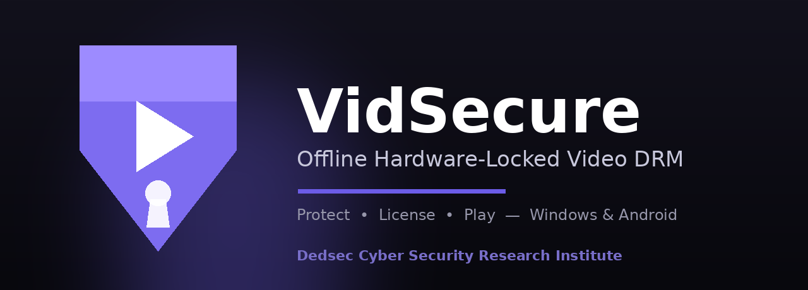
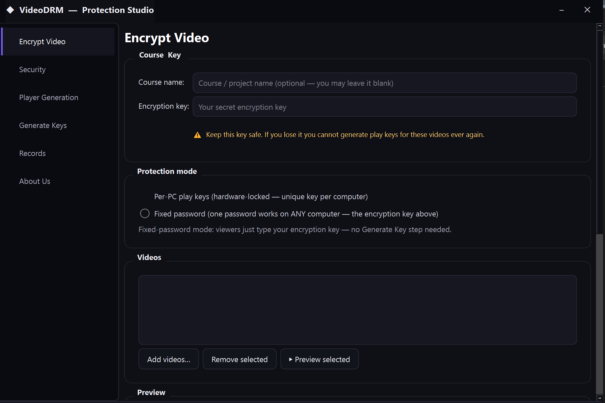

<p align="center">
  
</p>

<h1 align="center">VidSecure</h1>
<p align="center"><b>Offline, hardware-locked video DRM for Windows & Android — free to use.</b></p>

<p align="center">
  
  
  
  
</p>

<p align="center">
  <a href="../../releases/latest"></a>
  &nbsp;
  <a href="../../releases/latest"></a>
</p>

---

## What is VidSecure?

VidSecure lets you **sell or share videos without them being freely copied**. You
encrypt a video once, lock playback to a customer's specific device (or a password
you control), and give them a player. Everything runs **completely offline** — no
streaming server, no accounts, no monthly cloud fees.

It comes in two parts:

- **VidSecure Protector (Windows)** — the studio where you encrypt videos, set the
  rules (expiry, play-limit, watermark, anti-capture…), generate your own branded
  player, and create per-device keys.
- **VidSecure Player (Windows & Android)** — what your viewers use to play the
  protected files. The Android and Windows players are fully compatible with the
  same encrypted files.

---

## ⬇️ Download (free)

Grab the latest build from the **[Releases page](../../releases/latest)**:

| Platform | File | Notes |
|---|---|---|
| **Windows 10/11 (64-bit)** | `VidSecure-Setup.exe` | Installs the Protector + player builder |
| **Android 8.0+** | `VidSecure-Player.apk` | The mobile player |

> Android: enable "Install unknown apps" for your browser/file manager to install the APK.

---

## ✨ Features

**Protection & licensing**
- 🔐 AES-256 encryption; video is decrypted **in memory only** (never written to disk)
- 🖥️ **Per-device keys** (locked to one computer/phone) or a **shared password**
- 🎟️ One key can unlock a whole course/batch
- ⏳ **Expiry date** and **play-count / one-time-play** limits (rollback-proof)
- 🌐 Internet policy: require **online**, **offline**, or **either**

**Anti-piracy**
- 🚫 Blocks **screenshots & screen recording**
- 📵 Blocks **screen mirroring / casting** (Android)
- 🕵️ Anti-debugger, anti-VM, anti-root/Magisk, anti-Frida, anti-emulator, anti-clone
- 💧 **Moving watermark** with the viewer's Hardware ID — every leak is traceable

**Player & branding**
- 🎬 Your own name, icon, colours, logo, splash screen
- ▶️ Modern, smooth player — VLC-style gesture controls on Android
  (double-tap to seek, swipe for brightness/volume)
- 📱 Portrait & landscape, fit / zoom / stretch
- 🧾 Built-in license manager (add / view / remove)
- 📦 One-click **Windows installer** builder

---

## ⚙️ How it works

```
        VidSecure Protector (Windows)                 VidSecure Player (Windows / Android)
   ┌──────────────────────────────┐              ┌───────────────────────────────────┐
   │  video.mp4  ──►  encrypt  ──► │   video.vdx  │  open file → unlock → decrypt in  │
   │                              │   ─────────►  │  memory → play (with watermark)   │
   │  Hardware ID  ──► Key Gen  ──►│   play key    │  paste key / password to unlock   │
   └──────────────────────────────┘              └───────────────────────────────────┘
```

1. **Encrypt** your video in the Protector and choose the rules.
2. **Build** your branded player (or installer).
3. Your customer installs the player and sends you their **Hardware ID**.
4. You paste it into the **Key Generator** and send back a key. Only their device
   can play it.

Full step-by-step guides are in **[docs/](docs)**.

---

## 📸 Screenshots

> _Add your screenshots here (drop images in `assets/` and link them):_
>
> `

---

## 🖥️ System requirements

- **Windows:** Windows 10 or 11 (64-bit)
- **Android:** Android 8.0 (API 26) or newer, real device (emulators are blocked)
- No internet connection required to encrypt or play

---

## ❓ FAQ

See **[docs/faq.md](docs/faq.md)** — covers offline use, batch keys, device changes,
supported formats, and more.

---

## 🔒 Honest security note

No client-side DRM is truly unbreakable — a rooted device or a camera pointed at the
screen can still capture content, and anyone claiming "100% unrippable" is not being
honest. VidSecure **raises the bar dramatically**: it removes the easy copy, locks
files to devices, blocks the common capture and analysis tools, and **watermarks
every play so leaks are traceable**. That's strong, real-world protection for course
creators and video sellers.

---

## 🏛️ About

**VidSecure** is developed and maintained by the **Dedsec Cyber Security Research
Institute**.

- 🌐 Website: [dedseec.com](https://dedseec.com)
- 🧪 Research-driven, security-first tooling — released **free to use**.

## 📄 License

Free to use under the terms in **[LICENSE](LICENSE)** (freeware — see the file for
details). VidSecure is provided "as is", without warranty.
